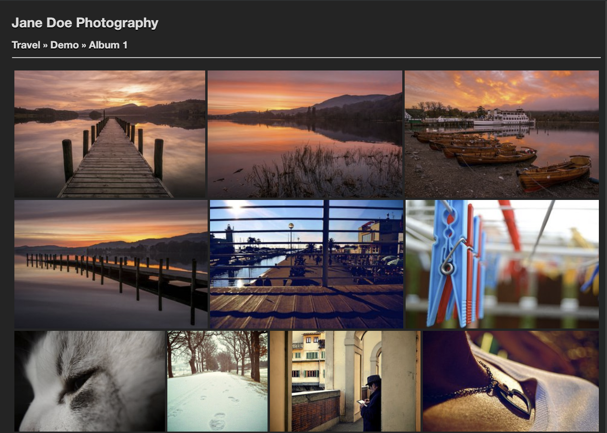

# Justified Light Theme for Sigal

A simple theme for [Sigal](https://github.com/saimn/sigal) using [Justified Gallery](https://miromannino.github.io/Justified-Gallery/) and [LightGallery](https://sachinchoolur.github.io/lightgallery.js) based on the Sigal's built-in theme [Galleria](https://github.com/saimn/sigal/tree/master/sigal/themes/galleria).



## Features

* Media view lightbox with [LightGallery](https://sachinchoolur.github.io/lightgallery.js)
* Album view with [Justified Gallery](https://miromannino.github.io/Justified-Gallery/)
* Collection view based on Sigal's built-in [Galleria](https://github.com/saimn/sigal/tree/master/sigal/themes/galleria) theme

## Configuration

Set the thumbnails to `320px` width and disable their cropping, i.e.:

```python
thumb_size = (320, 240)
thumb_fit = False
```

## TODO

* [ ] Show captions in LightGallery
* [ ] Sticky footer
* [ ] Configuration via `sigal.conf.py`
